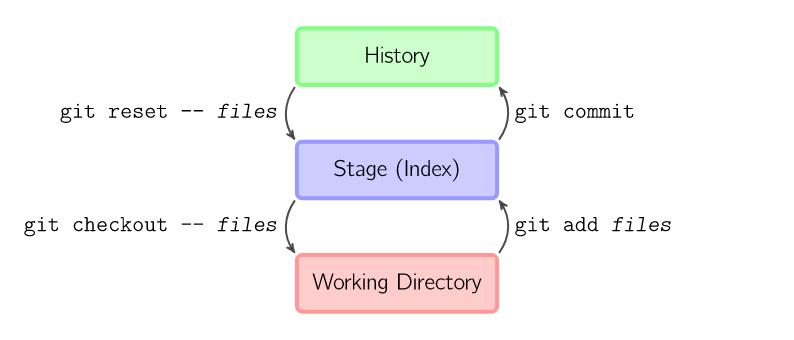

# README

GIT 30 Minutes, 先说明一个一般命令行工具的基本约定:

- 帮助
```sh
git --help
```
- 子命令帮助

```sh
git clone --help
```

## Git 基本命令

* 1. 创建GIT仓库:
  - git init
  - git clone 
  - git remote add origin <remote-url>

* 2. 修改内容
  - git add 
  - git commit
  - git pull
  - git push
  - git merge
  - git checkout
  - git reset




## Git Branch 分支管理

- git branch 
- git checkout
- git checkout -b feat/remote-branch
- git pull origin feat/remote-branch

## REFERENCE

- [git 图片](https://github.com/girliemac/a-picture-is-worth-a-1000-words.git)
- [git 图解](https://marklodato.github.io/visual-git-guide/index-zh-cn.html)


## Github Reference

- [connect-the-dots](https://github.com/skills/connect-the-dots)